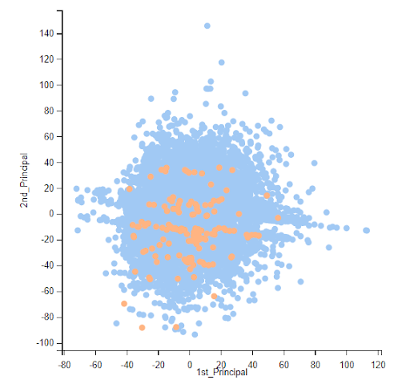
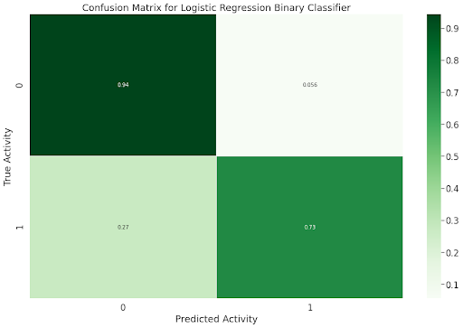

Predicting Cancerous p53 Mutants
==============================

## Purpose
The p53 protein is known as "the guardian of the cell". Normally, it regulates cell growth, among many other important functions, but mutations in p53 may lead to a dysfunctional protein that allows for the uncontrolled growth which is characteristic of many cancers. **In fact, mutated p53 proteins are found in more than 50% of all human cancers!**  The disastrous results of mutations in p53 make it a well-known oncogene implicated in many cancers. Being able to restore transcriptional activity in cancerous p53 would be very useful in the treatment of these cancers. Cancer scientists and pharmaceutical companies developing gene therapies for the treatment of cancer could make good use of this model.

Scientists are very interested in identifying if it is possible to restore the normal function of p53 and thus curb the growth of cancer. This project aims to identify mutants that could lead to functional rescue of p53 and regions of the p53 core domain that could be altered to "rescue" function by modeling mutant p53 transcriptional activity.

## Data
The data represents the biophysical attributes of mutant p53 proteins which are going to be used to predict the transcriptional activity of the mutant p53 proteins. The mutant proteins are all labeled “active” or “inactive”. Proteins labeled “inactive” are cancerous, while proteins labeled “active” have successfully had their normal transcriptional function “rescued”. There are 16772 instances, and each instance has 5409 attributes. Potential challenges for this dataset include known missing values, as well as the large number of attributes per instance. All of the attributes were extracted from biophysical simulations of mutant proteins, and the class labels (target) were determined experimentally, through *in vivo* assays.

The attributes are described as follows:
+ Attributes 1-4826 represent 2D electrostatic and surface based features. These are all represented by numerical values.
+ Attributes 4827-5408 represent 3D distance based features. These are all represented by numerical values.
+ Attribute 5409 is the class attribute, which is either active or inactive. This is a categorical variable.

## Methods
### Data Cleaning
These are snapshots of the starting data files. Right away, I can spot multiple problems with this data:
1) Missing values
2) Missing class labels
3) Column of "NaN"
4) High Dimensional dataset

Cleaning steps:
1) Concat numeric data with mutant labels
2) Now we have duplicate class attribute columns -> checked if they were equivalent -> dropped one col
3) Changed ?’s to np.NaN
4) Dropped rows that were entirely NaN (181 rows) -> no more NaN left
5) Check for duplicates (all values in the rows are equivalent) -> none
6) Check datatypes -> all “object”, which is good because less memory-intensive for computations than using floats + pandas stores strings as “object” datatype

This is the final clean, concatenated result. 

### Exploratory Data Analysis

The majority of mutants in the dataset have only two mutations, and single mutations or three or more mutations are less common. Four or more mutations was the least common of the group.

#### Dimensionality Reduction
One of the biggest obstacles in this project was the high dimensionality of this dataset. Since there are so many features, I cannot use the same strategies of exploratory data analysis that I would use for datasets with fewer features. There is also the *Curse of Dimensionality*, which teaches that more features can convolute and dilute a model's predictions. So now, my main goal is to find out which features are important for discerning between the two classes and which features do not give much helpful information and can be dropped from the feature set.
**orange = active (non-cancerous), blue = inactive (cancerous)**
**My goal is to predict the *active, or orange* samples.**

From the PCA projection, a few key observations are made: 
1) a large feature overlap between the two classes
2) highly imbalanced classes, as there are few *active* samples compared to *inactive* samples
3) long, separated clusters of "active" samples, which tells me that there are most likely key common features within each cluster that may help with predictions

To try to further separate the two classes, I used t-SNE (t-distributed Stochastic Nearest Embedding). This is an especially useful technique for high dimensional datasets, developed by Laurens van der Maaten and Geoffrey Hinton in 2008. t-SNE plots capture non-linear relationships and is thus a good choice for this data since the two classes are not linearly separable (see the PCA plot above). 

There is still a large feature overlap, but the t-SNE achieved better separation of the two classes. The t-SNE also revealed some small, tight clusters of *active* p53 mutants - an interesting observation to dig further into!

### Preprocessing Steps
The main goals in this stage of the project were:
1) make all the data numerical, including the class labels
2) scale the data
3) feature selection

#### Scaling the Data

The scale of the numerical features in this dataset greatly matters when preparing the data for a machine learning model. Since each feature represents a different type of measurement of the p53 proteins, there is a good chance that not all of the features are scaled in the same way. Some of the measurements could have different units or could even have been obtained through different methods!

Before I start removing features, I want to explore the standard deviations of these features. What are the ranges of the standard deviations? What is the smallest standard deviation? What is the largest standard deviation? What is the mean and median standard deviation? Are any of the standard deviations equal to 0? Doing this will give me a better idea of which features have relatively low variance and won't be useful.

One indicator of the uneven scaling of the numerical features is the large right skew that was seen when I visualized the distribution of the unscaled data's standard deviations. Many of the features had very low standard deviations (75% had standard deviations less than 0.89), and a few had much larger standard deviations, with the max standard deviation being 77.
By scaling the numerical data, I can reduce this skew and more accurately determine which features give little to no information. 

I used Scikit-learn's *MaxAbsScaler*, which scales each feature by its maximum absolute value. This estimator scales and translates each feature individually such that the maximal absolute value of each feature in the training set will be 1.0. It does not shift/center the data, and thus does not destroy any sparsity. Here is the distribution of the resulting scaled features' standard deviations.

There is a huge improvement in the range of the standard deviations, and while there is still a slight right skew, the outliers are not as great as they were before scaling the data.

#### Feature Selection

Due to the highly dimensional nature of this dataset (5408 features!!) and the resulting complexity, knowing where to start is difficult. More common visualization techniques for lower dimensional data are too computationally expensive and time-consuming to be useful at this point.

Some first steps to reduce dimensionality would be:

1) Search for features with no variance and drop these features, since they do not provide any information for our classification problem.
2) Look for multicollinearity in the features! Identify features that are highly linearly correlated with each other or features that have a high PMI (point-wise mutual information) score. These features are redundant, as having many features with a high PMI score or high linear correlation do not provide additional information.

Since I am not sure yet whether the features have linear or nonlinear (geometric?) relationships, I will be using both the linear correlation and the PMI scores (mutual information captures non-linear relationships) for the feature elimination/selection and comparing the results of both methods.

By using MaxAbsScaler before looking at the feature variances, I was able to reduce the dimensionality of my data from 5408 features to 555 features. Additionally, this new dataset preserves some of both the 2D and 3D features, whereas the previous method (without scaling data) got rid of all of the 3D features. This tells me that the 2D features and 3D features are scaled different from each other, so using MaxAbsScaler beforehand was a good choice here.

I made all the elements in the correlation matrix positive, because I only want to see if features are highly correlated at this point, not whether the features are positively correlated or negatively correlated.

This method returns 200 of the 2D features that are highly correlated.

Out of the 3D features, 13 of these had high linear correlations (above 0.90) and will be dropped. In total, I had 343 remaining features. 

### Modeling 

Now comes the big decision - which classifier model to use? To help me decide, I quickly ran baseline models for all of the available supervised learning algorithms in Scikit-Learn. 

Of the four different performance metrics presented in this report, I will be focusing on the "Balanced Accuracy", a particularly useful metric for evaluating imbalanced classifiers. Balanced accuracy is the arithmetic mean of the sensitivity and specificity.

A naive classifier, one that always predicts the majority (negative) class, would have a balanced accuracy of 0.50, or 50%. We can tell how much better any of the classification algorithms above are performing compared to a naive classifier by how much greater their balanced accuracy is than 50%.

The models with the highest balanced accuracy are:
1) Nearest Centroid
2) Gaussian Naive Bayes

In addition to these models, I will be training a Random Forest model and Logistic Regression model.

#### Random Forest

I chose Random Forest because it is highly optimizable and interpretable. However the report shows RandomForestClassifier has a balanced accuracy of only 52%, so it is barely doing better than a naive classifier that always predicts negative. Hyperparameter tuning can have a huge effect on model performance, though, so I will still give this one a chance.

#### Logistic Regression

I chose Logistic Regression Classifier because it is also very efficient to train, interpretable, and easy to implement. I expect this algorithm to perform better than the Random Forest, since the LogisticRegressionClassifier has a 61% balanced accuracy compared to the RandomForestClassifier's 52% balanced accuracy.

#### Gaussian Naive Bayes

#### Nearest Centroid

## Conclusions

## Future Improvements
+ Filtering Features Using Pairwise Mutual Information
+ Play with the number of features/attributes used to train the models to find optimum number of features
+ Instead of just a train-test-split, make a train-test-validation split of the data
+ Visualize the data with UMAP and Compare UMAP with t-SNE
+ Hyperparameter Tuning with Bayesian Optimization
+ Resampling Data with SMOTE-ENN and comparing noise with SMOTE-Tomek
+ Calibrating the Classifier Models
+ Neural Networks
+ Calculate the MCC scores
+ This was built using the 2010 dataset, but can combine with 2012 dataset
+ Investigate specific clusters of “active” p53 proteins, such as those seen in the t-SNE plots, more closely
+ Combine with protein visualization software for easier interpretation of the results
+ Maybe cross-check/sanity-check with information of which domains of p53 are the most important to preserving wild-type function
+ Use Cloud Computing services, containerize and deploy model

## Acknowledgments
Huge thank you to my mentor, Ricardo, for all of his encouragement and guidance throughout this capstone project! 

==============================
Project Organization

    ├── LICENSE
    ├── Makefile           <- Makefile with commands like `make data` or `make train`
    ├── README.md          <- The top-level README for developers using this project.
    ├── data
    │   ├── external       <- Data from third party sources.
    │   ├── interim        <- Intermediate data that has been transformed.
    │   ├── processed      <- The final, canonical data sets for modeling.
    │   └── raw            <- The original, immutable data dump.
    │
    ├── docs               <- A default Sphinx project; see sphinx-doc.org for details
    │
    ├── models             <- Trained and serialized models, model predictions, or model summaries
    │
    ├── notebooks          <- Jupyter notebooks. Naming convention is a number (for ordering),
    │                         the creator's initials, and a short `-` delimited description, e.g.
    │                         `1.0-jqp-initial-data-exploration`.
    │
    ├── references         <- Data dictionaries, manuals, and all other explanatory materials.
    │
    ├── reports            <- Generated analysis as HTML, PDF, LaTeX, etc.
    │   └── figures        <- Generated graphics and figures to be used in reporting
    │
    ├── requirements.txt   <- The requirements file for reproducing the analysis environment, e.g.
    │                         generated with `pip freeze > requirements.txt`
    │
    ├── setup.py           <- makes project pip installable (pip install -e .) so src can be imported
    ├── src                <- Source code for use in this project.
    │   ├── __init__.py    <- Makes src a Python module
    │   │
    │   ├── data           <- Scripts to download or generate data
    │   │   └── make_dataset.py
    │   │
    │   ├── features       <- Scripts to turn raw data into features for modeling
    │   │   └── build_features.py
    │   │
    │   ├── models         <- Scripts to train models and then use trained models to make
    │   │   │                 predictions
    │   │   ├── predict_model.py
    │   │   └── train_model.py
    │   │
    │   └── visualization  <- Scripts to create exploratory and results oriented visualizations
    │       └── visualize.py
    │
    └── tox.ini            <- tox file with settings for running tox; see tox.readthedocs.io

--------

<small>Project based on the <a target="_blank" href="https://drivendata.github.io/cookiecutter-data-science/">cookiecutter data science project template</a>. #cookiecutterdatascience</small>

"# p53_Rescue_Mutants" 
